# duel-api

**A private-API automation toolkit for duel.com — whose backtester concludes you shouldn't bet.**

I reverse-engineered the site's undocumented API, built the session-capture and drift-detection machinery to talk to it reliably, then built the strategy tester everyone actually wants — and it returned `optimal stake = 0` at every observed edge tier. That result shipped as a feature.



## Install

Zero-install with [uv](https://docs.astral.sh/uv/) (recommended):

```console
$ uvx --from "git+https://github.com/kingkillery/Duel-api" duel-api doctor
```

Or the usual ways:

```console
$ pipx install git+https://github.com/kingkillery/Duel-api
$ git clone https://github.com/kingkillery/Duel-api && pip install -e ".[all]"
```

Requires Python ≥ 3.10. Heavy extras are opt-in: `[browser]` (playwright), `[realtime]` (socket.io), `[sandbox]` (fastapi), `[pretty]` (rich).

## First run

```console
$ duel-api doctor
capabilities
│ component       │ state │ extra    │ unlocks                           │
│ httpx           │   ✓   │ core     │ every network command             │
│ python-socketio │   ✓   │ realtime │ betfeed read-only live-bet stream │
│ playwright      │   ✓   │ browser  │ capture_session browser capture   │

what you can run
│ tier             │ ready │ notes                            │
│ offline          │  yes  │ no network, no session, no extras │
│ live money       │  yes  │ gated four deep - see docs       │

next step
  ready - try: duel-api whoami
```

Or skip straight to the verdict — the offline strategy comparison, no session, no network:

```console
$ duel-api demo
```

`doctor` is offline and safe to run anywhere — it tells you exactly which tier you can use and what is missing, so an absent optional dependency never looks like a broken tool.

## What this is

- **A private-API methodology, production-grade.** Capture → Spec → Replay → Refresh, a bundle-hash drift tripwire, typed failure taxonomy, tri-state session staleness, bounded auto-refresh (exactly 2 requests).
- **An honest backtester.** AST-guarded network-free, Monte Carlo, fractional Kelly — which *fails closed* at negative EV.
- **297 tests**, MIT-licensed.

## What this isn't

- A money printer. `E[net] = −edge × E[total wagered]`; sizing changes variance, never sign. Full analysis: [docs/backtest-math.md](docs/backtest-math.md).

## What it won't do

- **Deposit or withdraw** — blocked unconditionally at the client layer.
- **Bypass bot gates** — the realtime feed refuses non-browser handshakes; the tool reports it and stays read-only.
- **Bet by accident** — money commands are gated four deep ([docs/betting-gates.md](docs/betting-gates.md)).

## Quick reference

| Tier | Commands |
|---|---|
| Offline | `doctor`, `spec`, `session-status`, `demo`, `audit` — no network, no session |
| Read-only live | `whoami`, `metadata`, `games`, `rates`, `spec-check`, `call GET` |
| Realtime | `betfeed` (read-only) |
| State-changing | `settings-update`, `seed-set`, `seed-rotate`, `2fa-setup` — require `--yes` |
| Money | `dice-bet`, `autobet` — gated four deep, browser-minted token required |

### Hosted sandbox (scaffold)

`pip install -e ".[sandbox]" && uvicorn sandbox.app:app` serves the engine as a
one-page web toy — safe to host because the engine is network-free by AST guard,
so the service cannot be talked into making an outbound request.

## Documentation

| Doc | Contents |
|---|---|
| [methodology.md](docs/methodology.md) | Capture→Spec→Replay→Refresh, endpoint inventory, provenance, money gates |
| [session-lifetime.md](docs/session-lifetime.md) | `__cf_bm` TTL, tri-state staleness, bounded refresh, CDP capture |
| [backtest-math.md](docs/backtest-math.md) | The invariant, Kelly = 0, measured Monte Carlo results |
| [betting-gates.md](docs/betting-gates.md) | Four-deep gating, token rules, what is refused |
| [why-i-built-this.md](docs/why-i-built-this.md) | The story, and the honest ask |

## Support this work

If you found the methodology useful, the best thanks is a star. If you play on duel.com anyway — entertainment money only — the author's referral link is in [why-i-built-this.md](docs/why-i-built-this.md). It's a footnote on purpose.

## Scope & fair warning

Automating against duel.com may violate its Terms of Service; that risk is yours. Captured sessions are credentials — this repo gitignores them and so should you. Nothing here is financial advice, and no stake schedule changes the sign of expectation.

If gambling stops being fun: **1-800-GAMBLER** (US), or search your national helpline.

## License

MIT — see [LICENSE](LICENSE). The code license grants no permission to violate duel.com's Terms of Service.
